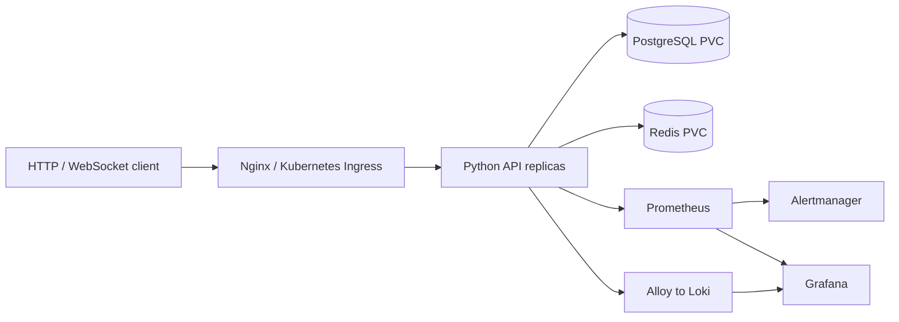

# production-k8s-platform

Production-like homelab project created to practice and demonstrate DevOps/SRE engineering patterns. It is not presented as commercial production experience.

A Python API with stateful dependencies, explicit health semantics, rolling releases and an observable Redis failure. All services run locally without a cloud account. See [VALIDATION.md](VALIDATION.md) for measured validation status, not performance claims.



## Requirements and quick start

Docker Engine with Compose, Python 3.11, Make. Allow approximately 4 GB of Docker memory for Compose. Kubernetes adds kubectl, Helm 3 or 4, kind, a default StorageClass and optional metrics-server/Ingress controller. The default kind profile uses one node and is intended for a 4 GB Docker VM with other labs stopped. `k8s/kind-ha.yaml` provides a three-node layout for a host with at least 8 GB Docker memory; it is not the default on an 8 GB physical Mac. Use a dedicated cluster; never run incident commands against an employer cluster.

```bash
make init
make install test
make up
make smoke
curl http://127.0.0.1:8280/items
```

`make init` creates random credentials in an ignored, mode-0600 `.env`; `.env.example` documents required variable names. `make down` stops services while retaining named data volumes. Nginx exposes HTTP on localhost:8280, Grafana localhost:3000 (admin; password in local `.env`), Prometheus localhost:9090 and Alertmanager localhost:9093. WebSocket `/ws` echoes JSON; probes `/live` and `/ready` separate process health from dependency health. `/metrics` exports counters, a histogram and Python process metrics. Input is validated and SQL is parameterized. Redis availability is deliberately required on reads; list reads use a five-second cache with versioned invalidation after writes. This is bounded eventual consistency, not a transactional cache guarantee or benchmark.

## Kubernetes deployment

```bash
kind create cluster --name portfolio --image kindest/node:v1.37.0 --config k8s/kind.yaml
kind load docker-image platform-backend:local --name portfolio
kubectl --context kind-portfolio create namespace platform
python3 scripts/k8s-secrets.py --namespace platform
helm install platform helm/platform --namespace platform --set hpa.enabled=false --wait --timeout 5m
kubectl -n platform port-forward service/platform-backend 8280:8000
```

The default chart uses the external Secret created by the helper. An optional `templates/secret.yaml` supports CI-managed creation with `secrets.create=true` and required `postgresPassword`, `grafanaPassword`, `databaseUrl` fields under `secrets`, supplied via an ignored mode-0600 values file from protected CI variables. Do not put secret values in CLI arguments or Git. Helm stores those values in release Secrets, so restrict their access. Choose the helper or chart creation, never both. The secret helper creates once and refuses an existing Secret; changing a Postgres Secret alone does not rotate a persisted DB password. For raw manifests, use `kubectl -n platform apply -f k8s/platform.yaml` after creating the same Secret. Raw manifests and Helm are alternative ownership modes: do not use both on the same resources.

Port-forward is the verified local access path; the Ingress object requires the separately installed Traefik controller described below and host resolution for `platform.localhost`. HPA requires metrics-server; default chart values enable it, while kind quick start disables it. Two backend replicas, PDB minAvailable=1 and soft topology spreading tolerate a voluntary disruption of one API pod; single PostgreSQL/Redis and host storage do not provide data-tier HA. Startup allows DB initialization, readiness checks dependencies, and liveness does not restart healthy processes for external outages. Uvicorn drains requests within 20 seconds inside the 30-second pod termination window; long WebSocket sessions can disconnect and clients must reconnect.

## Ingress and HPA prerequisites

```bash
helm repo add traefik https://traefik.github.io/charts
helm repo update
helm install traefik traefik/traefik --version 41.6.1 --namespace ingress --create-namespace --set service.type=ClusterIP --wait
kubectl -n ingress port-forward service/traefik 8281:80
# In a second terminal:
curl -H 'Host: platform.localhost' http://127.0.0.1:8281/items
```

For HPA on this disposable kind cluster, install metrics-server:

```bash
kubectl --context kind-portfolio apply -f https://github.com/kubernetes-sigs/metrics-server/releases/download/v0.9.0/components.yaml
kubectl --context kind-portfolio -n kube-system patch deployment metrics-server --type=json -p '[{"op":"add","path":"/spec/template/spec/containers/0/args/-","value":"--kubelet-insecure-tls"}]'
kubectl --context kind-portfolio -n kube-system rollout status deployment/metrics-server
helm upgrade platform helm/platform -n platform --set hpa.enabled=true --wait
kubectl -n platform get hpa
```

The insecure kubelet certificate flag is for kind's local certificates only. A real cluster must use trusted kubelet certificates instead. The API client used for validation matches Kubernetes 1.37. Local cold image downloads can exceed five minutes; preload dependency images from the Compose run with `kind load docker-image` or increase the wait timeout before retrying the release.

## Helm releases and rollback

```bash
helm lint helm/platform
helm template platform helm/platform > /tmp/platform.yaml
helm upgrade platform helm/platform -n platform --set hpa.enabled=false --wait --timeout 5m
helm history platform -n platform
helm rollback platform 1 -n platform --wait --timeout 5m
kubectl -n platform rollout status deployment/platform-backend
```

Use unique image tags for meaningful upgrades and load them into kind before updating `image`. Chart revision 1 is the known baseline in this walkthrough. Image rollback cannot undo database writes or incompatible migrations. Schema initialization uses only `CREATE TABLE IF NOT EXISTS`; future migrations require expand/contract and a backup before destructive changes.

## Monitoring and incident drill

The chart includes Prometheus, Alertmanager, Loki, per-pod Alloy and Grafana. Prometheus discovers every backend endpoint with namespace-scoped RBAC. Grafana config provisions the service dashboard and both data sources. Compose uses the same rules/configs. Alerts cover unavailable scrape target, server error fraction, p95 latency, dependency errors and process RSS. Alertmanager intentionally has no external delivery integration: inspect the UI; real notification credentials belong in CI variables/Secrets.

```bash
make incident
curl -i http://127.0.0.1:8280/items
make recover
make smoke
```

See [RUNBOOK.md](RUNBOOK.md) for diagnosis and recovery, and [docs/decisions.md](docs/decisions.md) for tradeoffs. Dashboards are empty until real traffic arrives; no synthetic benchmark claims are supplied.

## Troubleshooting, security and limitations

Run `docker compose ps`, `docker compose logs backend redis postgres`, or `kubectl -n platform get pods,pvc,events`. A Pending PVC needs a StorageClass; ImagePullBackOff on kind needs `kind load`; HPA unknown metrics needs metrics-server. Readiness can fail while liveness remains healthy during the Redis incident.

The API runs as a non-root user with a read-only root filesystem, bounded resources and no service-account token. Only loopback ports are exposed by Compose. Database credentials never enter Git. This is an isolated trusted lab: there is no API authentication, Redis authentication, TLS, NetworkPolicy, database replication or backup scheduler. Do not expose it publicly. For HTTPS use a real certificate Secret and TLS ingress configuration; do not mistake localhost HTTP for encrypted traffic. Prometheus/Loki admin surfaces are internal or port-forwarded. Single-instance monitoring and Grafana ephemeral Kubernetes storage are lab limitations. Alloy file tailing avoids Docker socket access but a pod deletion may lose unsent log lines.

This project demonstrates dependency-aware probes, bounded failure, safe SQL, WebSocket reverse proxying, service discovery, persistent state, rolling deployment, rollback boundaries, basic monitoring and incident reasoning.
